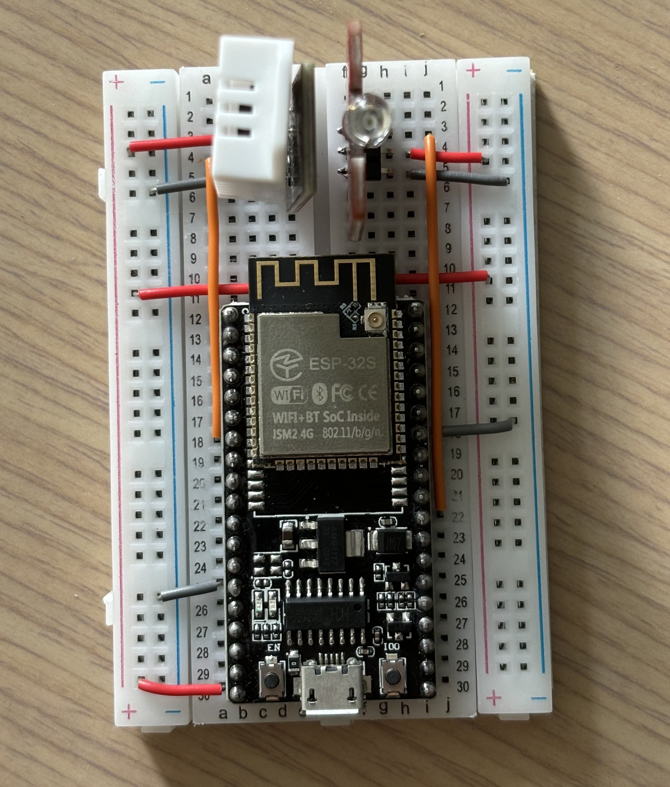

 # HomeKit Air Conditioner

HomeKit air conditioner remote control built with ESP32 (NodeMCU-32S) and [HomeSpan](https://github.com/HomeSpan/HomeSpan)

The IR signal of the Teco A/C is also decoded and analyzed in this project. (My A/C is not supported by the [IRremoteESP8266](https://github.com/crankyoldgit/IRremoteESP8266) library 🥲)

## Components

The Homekit accessory contains multiple services:

- [Thermostat](https://github.com/HomeSpan/HomeSpan/blob/master/docs/ServiceList.md#thermostat-4a): the main service of the remote control
- [Fan](https://github.com/HomeSpan/HomeSpan/blob/master/docs/ServiceList.md#fan-b7): utilize the rotation speed to set up different modes. Both swing and fan mode are the Fan service

## Source code

- air-conditioner: the main project for the remote control
- passive-sensor: test project that built a HomeSpan accessory for DHT22 sensor
- irsend: test project for IR signal decoding and transmitting

## Hardware Device

- [NodeMCU-32S](https://docs.ai-thinker.com/esp32/boards/nodemcu_32s)
- DHT22: Temperature, humidity sensor
- Keyes IR Transmitter: Sending the signal to A/C
- Keyes IR Receiver: Decoding the IR signal from your remote control
- Homepod mini: HomeKit accessories require Homepod/AppleTV as home hub

## Libraries

- [HomeSpan](https://github.com/HomeSpan/HomeSpan)
- [Adafruit DHT Sensor Library](https://github.com/adafruit/DHT-sensor-library)
- [IRremoteESP8266](https://github.com/crankyoldgit/IRremoteESP8266)

## Layout

